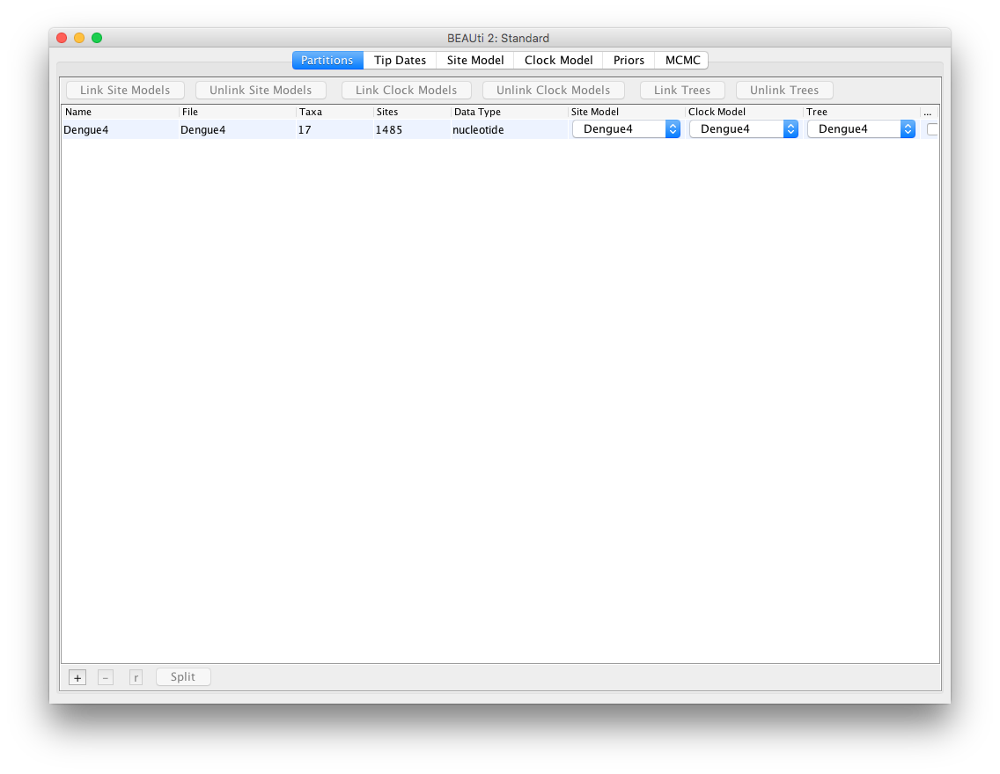
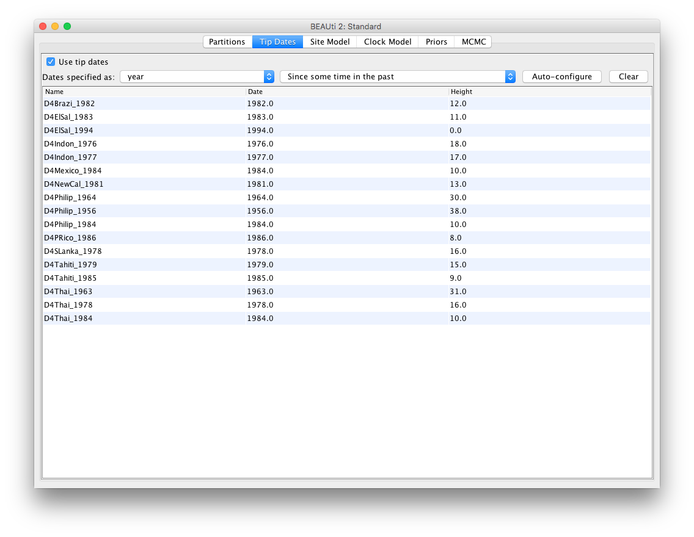
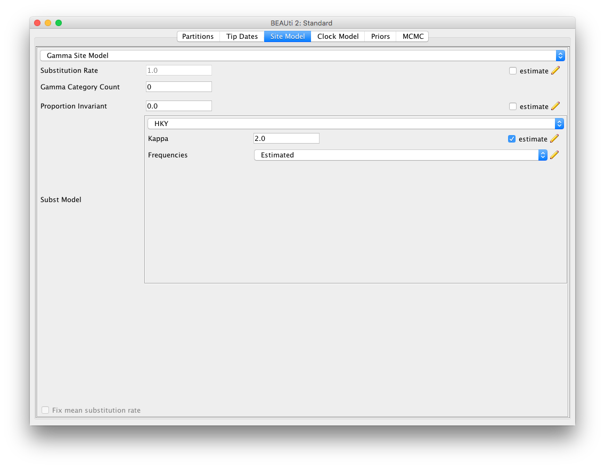
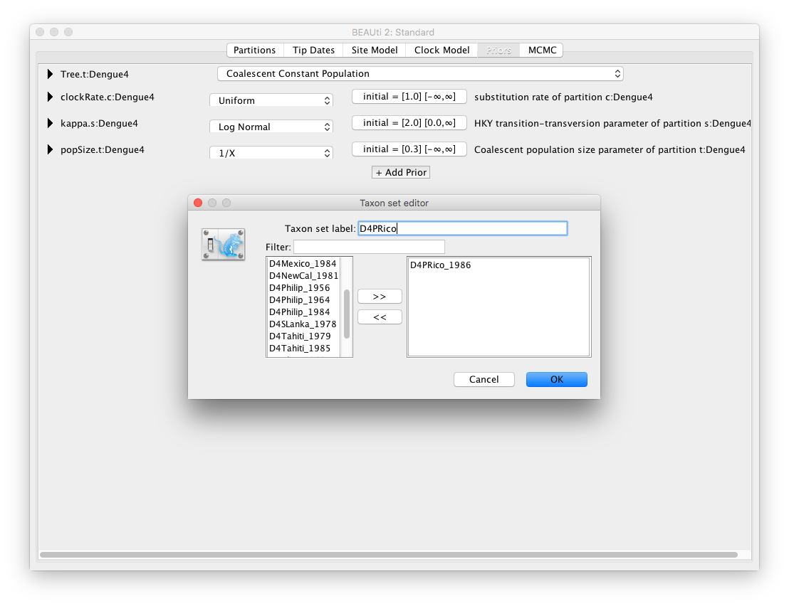
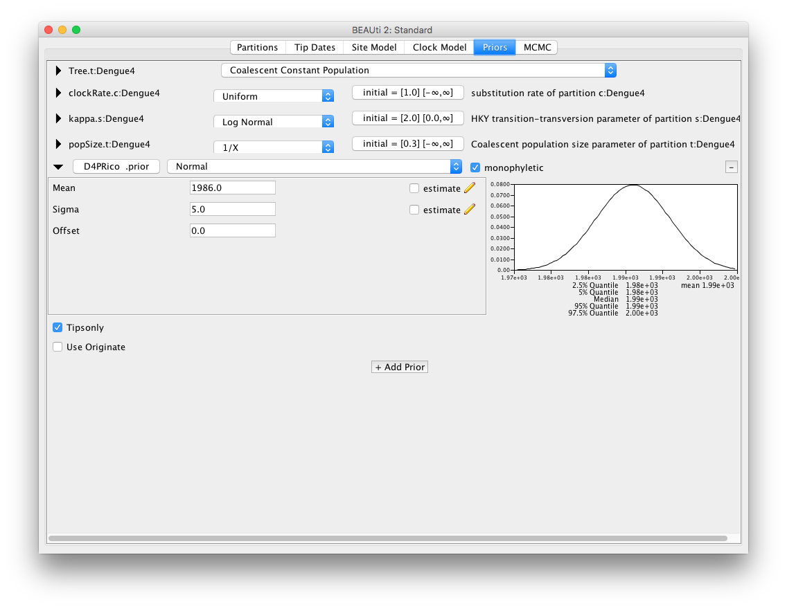
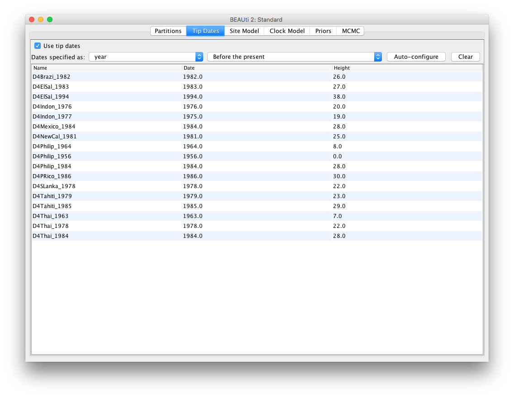
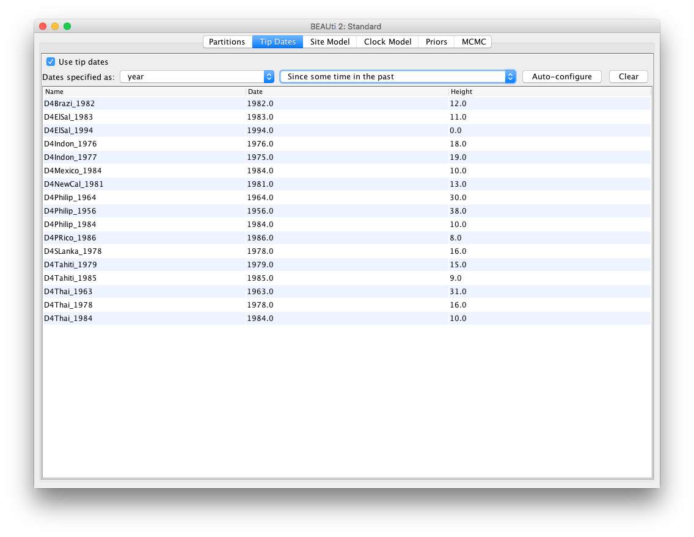

# Background

How to estimate the sampling times of sequences in BEAST2.


----

# Programs used in this Exercise 

BEAST2 ([http://www.beast2.org](http://www.beast2.org)) is a free software package for Bayesian evolutionary analysis of molecular sequences using MCMC and strictly oriented toward inference using rooted, time-measured phylogenetic trees. This tutorial is written for BEAST v{{ page.beastversion }} . 


### BEAUti2 - Bayesian Evolutionary Analysis Utility

BEAUti2 is a graphical user interface tool for generating BEAST2 XML configuration files.

Both BEAST2 and BEAUti2 are Java programs, which means that the exact same code runs on all platforms. For us it simply means that the interface will be the same on all platforms. The screenshots used in this tutorial are taken on a Mac OS X computer; however, both programs will have the same layout and functionality on both Windows and Linux. BEAUti2 is provided as a part of the BEAST2 package so you do not need to install it separately.


### Tracer

Tracer ([http://tree.bio.ed.ac.uk/software/tracer](http://tree.bio.ed.ac.uk/software/tracer)) is used to summarise the posterior estimates of the various parameters sampled by the Markov Chain. This program can be used for visual inspection and to assess convergence. It helps to quickly view median estimates and 95% highest posterior density intervals of the parameters, and calculates the effective sample sizes (ESS) of parameters. It can also be used to investigate potential parameter correlations. We will be using Tracer v{{ page.tracerversion }}.


----

# Practical: Exercise title

## Estimating a single tip-date

If only one or a few tip-dates need to be estimated this can easily be set in BEAUti. 

> Load the file `Dengue4.env.nex` into BEAUti. Auto-configure the tip-dates, set the site model to HKY and leave the clock model on a strict clock (Figure 1-4).

<figure>
  <a id="fig:"></a>
  
  <figcaption>Figure 1: 
</figcaption>
</figure>
<br>

<figure>
  <a id="fig:"></a>
  
  <figcaption>Figure 2: 
</figcaption>
</figure>
<br>

<figure>
  <a id="fig:"></a>
  
  <figcaption>Figure 3: 
</figcaption>
</figure>
<br>

<figure>
  <a id="fig:"></a>
  
  <figcaption>Figure 4: 
</figcaption>
</figure>
<br>

> In the priors panel set the tree-prior to a constant coalescent model. 
>
> Click **+ Add prior** in the bottom. 
> 
> Select MRCAPrior and add only the sequence `D4PRico_1986` to the taxon set and give the taxon set a sensible name.
>
> Select a normal distribution with mean 1986 and standard deviation 5 for the prior on the taxon set. Make sure to check **monophyletic** and **Tipsonly**.

<figure>
  <a id="fig:"></a>
  
  <figcaption>Figure 5: 
</figcaption>
</figure>
<br>

<figure>
  <a id="fig:"></a>
  
  <figcaption>Figure 6: 
</figcaption>
</figure>
<br>

> Set the length of the MCMC chain to 10`000`000 and the sampling frequency to 10`000. 
> 
> Run the file in BEAST2.

This will estimate the sampling date for the sequence `D4PRico_1986`. 

> Load the previous XML file into BEAUti
>
> Change the length of the MCMC chain to 100`000`000 and the sampling frequency to 100`000.
> 
> Check sample from prior in the bottom and run in BEAST2.


<figure>
  <a id="fig:"></a>
  
  <figcaption>Figure 7: 
</figcaption>
</figure>
<br>

> **Topics for discussion:** 
>
> Do you think there is enough information in the dataset to estimate the sampling date for `D4PRico_1986`? (compare the prior and posterior estimates for the height of the sampled tip). 
>
> Did the analysis sampling from the prior mix?


## Estimating many tip-dates

To estimate many tip-dates it is easier to specify the calibrations in a Nexus file. (This requires saving your sequence file in the Nexus format). 

> Open `Dengue4.env.calibrations` in a text editor.

```
#NEXUS

BEGIN DATA;
	DIMENSIONS NTAX=17 NCHAR=1485;
	FORMAT MISSING=? GAP=- DATATYPE=DNA;
	MATRIX
D4Brazi_1982       ATGCGATGCGTAGGAGTAGGAAACAGAGACTTTGTGGAAGGAGTCTCAGGTGGAGCATGGGTCGACCT...
D4ElSal_1983       ATGCGATGCGTAGGAGTAGGAAACAGAGACTTTGTGGAAGGAGTCTCAGGTGGAGCATGGGTCGACCT...
D4ElSal_1994       ATGCGATGCGTAGGAGTAGGAAACAGAGACTTTGTGGAAGGAGTCTCAGGTGGAGCATGGGTCGACCT...
D4Indon_1976       ATGCGATGCGTAGGAGTAGGAAACAGAGACTTTGTGGAAGGAGTCTCAGGTGGAGCATGGGTCGATCT...
D4Indon_1977       ATGCGATGCGTAGGAGTAGGAAACAGAGACTTTGTGGAAGGAGTCTCAGGTGGAGCATGGGTCGATCT...
D4Mexico_1984      ATGCGATGCGTAGGAGTAGGAAACAGAGACTTTGTGGAAGGAGTCTCAGGTGGAGCATGGGTCGACCT...
D4NewCal_1981      ATGCGATGCGTAGGAGTAGGAAACAGAGACTTTGTGGAAGGAGTCTCAGGTGGAGCATGGGTCGACCT...
D4Philip_1964      ATGCGATGCGTGGGAGTGGGGAACAGAGACTTTGTGGAAGGAGTCTCAGGTGGAGCATGGGTCGATTT...
D4Philip_1956      ATGCGATGCGTGGGAGTGGGGAACAGAGACTTTGTGGAAGGAGTCTCAGGTGGAGCATGGGTCGATTT...
D4Philip_1984      ATGCGATGCGTAGGAGTGGGGAACAGAGACTTTGTGGAAGGAGTCTCAGGTGGAGCATGGGTCGACTT...
D4PRico_1986       ATGCGATGCGTAGGAGTAGGAAACAGAGACTTTGTGGAAGGAGTCTCAGGTGGAGCATGGGTCGACCT...
D4SLanka_1978      ATGCGATGCGTGGGAGTGGGGAACAGAGACTTTGTGGAAGGAGTCTCAGGTGGAGCATGGGTCGATCT...
D4Tahiti_1979      ATGCGATGCGTAGGAGTAGGAAACAGAGACTTTGTGGAAGGAGTCTCAGGTGGAGCATGGGTCGATCT...
D4Tahiti_1985      ATGCGATGCGTAGGAGTAGGAAACAGAGACTTTGTGGAAGGAGTTTCAGGTGGAGCATGGGTCGATTT...
D4Thai_1963        ATGCGATGCGTAGGAGTGGGGAACAGGGACTTTGTGGAAGGAGTCTCAGGTGGAGCATGGGTCGATCT...
D4Thai_1978        ATGCGATGCGTAGGAGTGGGGAACAGAGACTTTGTAGAAGGAGTCTCAGGTGGAGCATGGGTCGATCT...
D4Thai_1984        ATGCGATGCGTAGGAGTAGGGAACAGAGACTTTGTAGAAGGAGTCTCAGGTGGAGCATGGGTCGATCT...
	;
END;

BEGIN ASSUMPTIONS;	
	OPTIONS SCALE = years;

	CALIBRATE D4ElSal_1994  = fixed(1994),
	CALIBRATE D4PRico_1986  = uniform(1984,1988),
	CALIBRATE D4Tahiti_1985 = offsetexponential(1984,1),
	CALIBRATE D4Mexico_1984 = normal(1984,5),
	CALIBRATE D4Philip_1984 = lognormal(1984,1.5),
	CALIBRATE D4Thai_1984   = offsetlognormal(1980,4,1.25),
	CALIBRATE D4Brazi_1982  = offsetgamma(1980,2,1),
	CALIBRATE D4ElSal_1983  = fixed(1983),
	CALIBRATE D4NewCal_1981 = fixed(1981),
	CALIBRATE D4Tahiti_1979 = fixed(1979),
	CALIBRATE D4SLanka_1978 = fixed(1978),
	CALIBRATE D4Thai_1978   = fixed(1978),
	CALIBRATE D4Indon_1977  = fixed(1975),
	CALIBRATE D4Indon_1976  = fixed(1976),
	CALIBRATE D4Philip_1964 = fixed(1964),
	CALIBRATE D4Thai_1963   = fixed(1963),
	CALIBRATE D4Philip_1956 = fixed(1956);
		
END;

```

The block `BEGIN ASSUMPTIONS` contains the calibrations for tip dates. The following options are available:

- **fixed(year>):** Fixed tip-date (not estimated)
- **uniform(lower>,upper)** 
- **normal(mean>,stdev)**
- **lognormal(M,S):** Note that the mean is given in real space!
- **gamma(shape,scale)**
- **offsetgamma(offset,shape,scale)**
- **offsetlognormal(offset,M,S):** Mean in real space!

> Open BEAUti and load `Dengue4.env.calibrations`.

Note that the tip-dates have been set in the **Tip Dates** panel. However note that the direction is wrong, it is set to **Before the present** and we want it to be **Since some time in the past**. (As it is, the height of 0.0 is at the oldest sequence. It should be at the newest sequence, `D4ElSal_1994`). 

<figure>
  <a id="fig:"></a>
  
  <figcaption>Figure 8: 
</figcaption>
</figure>
<br>

<figure>
  <a id="fig:"></a>
  
  <figcaption>Figure 9: 
</figcaption>
</figure>
<br>

> Set the site model, clock model and tree-prior as in the previous excercise.

Note that the priors for the tip-dates are already set. 

> Set the MCMC settings as in the previous excercise and run the model. 


## Estimating all tip-dates

> Set up the same analyses as before with `Dengue4.env.allnormal.nex` or `Dengue4.env.alluniform.nex`. 

In this case a normal or uniform distribution is used as the prior for every tip-date. Remember to change the direction of the dates after loading the nexus file into BEAUti!

> **Topic for discussion:** Is there still enough information in the dataset to estimate the sampling dates?


# Discussion

When there is uncertainty in the sampling times of a few sequences the data may be informative enough to estimate the true sampling times with some accuracy. However, when many sequences have uncertain sampling times it is much more likely that the posterior simply recovers the prior. In these cases the analysis integrates over the uncertainty in the sampling times (treating the sampling time as a nuisance parameter), but is rarely informative enough to estimate sampling times. In many cases estimating the sampling times of many sequences can also make it more difficult for the analysis to mix properly and achieve high ESS values.


----

# Useful Links

- [Bayesian Evolutionary Analysis with BEAST 2](http://www.beast2.org/book.html) 
- BEAST 2 website and documentation: [http://www.beast2.org/](http://www.beast2.org/)
- BEAST 1 website and documentation: [http://beast.bio.ed.ac.uk](http://beast.bio.ed.ac.uk)
- Join the BEAST user discussion: [http://groups.google.com/group/beast-users](http://groups.google.com/group/beast-users) 

----

# Relevant References



